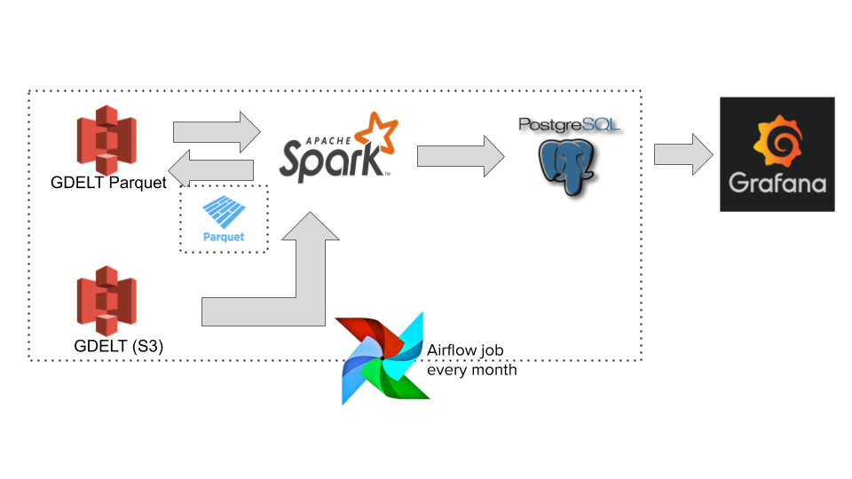

# Trendustries
Using GDELT events data to provide trending of the business sectors.

[Trendustries](https://docs.google.com/presentation/d/1Ac4zOok6FbNJ7UfcnFMbY5wfHUFLPWu_-mNgvXp4lzs/edit?usp=sharing) presentation.

## Required installation, tools up and running
- Apache Spark
- PostgreSQL Database
- Grafana
- Airflow
- Python
- pandas
- Parquet
- Amazon EC2 instances
- Amazon S3

## Introduction
Starting a new business in a particular business sector is a challenge for anyone who wants to make it highly profitable. Knowing the recent & historical trending of the business sectors in a given location is critical (For the purpose of this project, location refers to a state). Trendings of the business sectors directs anyone to start successful business in a particular location. The goal of this project is to provide these business sector trendings to the user in a selected location which helps him to convert it into a moneymaking business. 

## Dataset
Global Database of Events, Languages and Tone (GDELT).
The GDELT project collects news stories from print and web sources from around the world. It's able to identify business sectors, organizations, and business events that are driving the global soceity. 

## Architecture

GDELT's historical data exists in an Amazon S3 bucket. An offline Apache Spark batch processing job reads the data from S3, writes in a parquet format to S3 bucket and again loads data from it perform various Spark functions on it. The processed data is saved in a PostgreSQL database. Grafana is the user facing component for this architecture. The user is able to specify a state, and a business sector they're interested in. Grafana makes the appropriate queries to the PostgreSQL database. The results are viewed on the Grafana dashboard.

New GDELT updates are acquired from the source. A Python script uploads the new raw data to S3 followed by above mentioned spark job yo process it. GDELT updates are posted every 15 minutes, but trending results will be updated after every month and so Airflow workflow is scheduled to complete this process on new data in a monthly basis.

## Engineering challenges

## Trade-offs